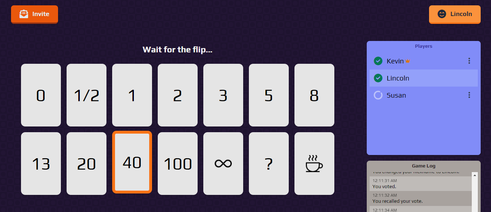
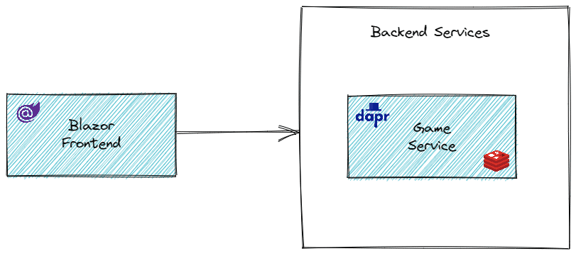

# Scrummy

An Agile Poker online multiplayer game built using .NET, powered by [Dapr](https://dapr.io/).



## Architecture

Scrummy is composed of:

- A frontend web-app written in [Blazor](https://dotnet.microsoft.com/apps/aspnet/web-apps/blazor)
- A backend game service leveraging the virtual actor pattern and [SignalR](https://dotnet.microsoft.com/en-us/apps/aspnet/signalr)



## Getting Started

To get a local copy up and running follow these simple example steps.

### Prerequisites

- [.NET 6.0 SDK](https://dotnet.microsoft.com/en-us/download/dotnet/6.0)
- [Docker Desktop](https://www.docker.com/get-started)

### Installation

Clone the repo:

```
https://github.com/k-schneider/scrummy-dapr.git
```

## Usage

To start Scrummy from the CLI, run the following command from the root folder:

```
docker-compose up
```

Once all services are running you can access the following services:

- Frontend Web Blazor: [http://localhost:5102](http://localhost:5102)
- Backend Game Service: [http://localhost:5101](http://localhost:5101)
- Health Checks: [http://localhost:5103/healthchecks-ui](http://localhost:5103/healthchecks-ui)
- Zipkin Traces: [http://localhost:5411/zipkin](http://localhost:5411/zipkin)
- Seq Logs: [http://localhost:5340](http://localhost:5340)

## Roadmap

- [x] Common agile poker decks
- [x] Nudge players
- [x] Promote other player to host
- [x] Spectator mode
- [ ] Custom decks

## Contributing

Contributions are what make the open source community such an amazing place to learn, inspire, and create. Any contributions you make are **greatly appreciated**.

If you have a suggestion that would make this better, please fork the repo and create a pull request. You can also simply open an issue with the tag "enhancement".
Don't forget to give the project a star! Thanks again!

1. Fork the Project
2. Create your Feature Branch (`git checkout -b feature/AmazingFeature`)
3. Commit your Changes (`git commit -m 'Add some AmazingFeature'`)
4. Push to the Branch (`git push origin feature/AmazingFeature`)
5. Open a Pull Request

## License

Distributed under the MIT License. See `LICENSE.txt` for more information.

## Contact

Kevin Schneider - k.schneider@outlook.com

Project Link: [https://github.com/k-schneider/scrummy-dapr](https://github.com/k-schneider/scrummy-dapr)
